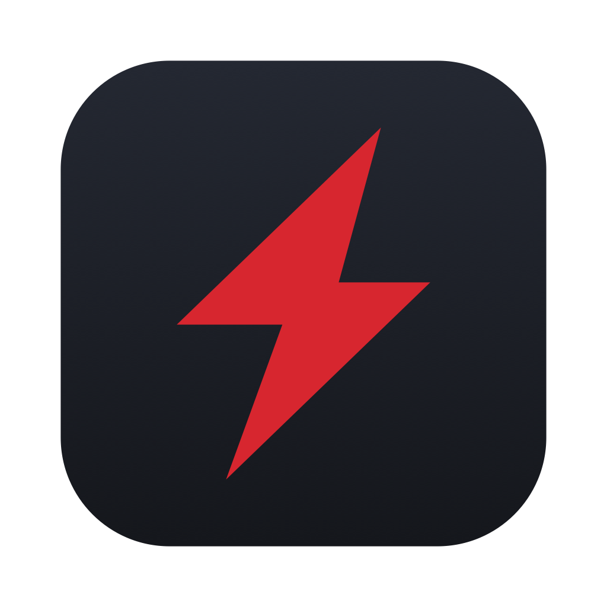
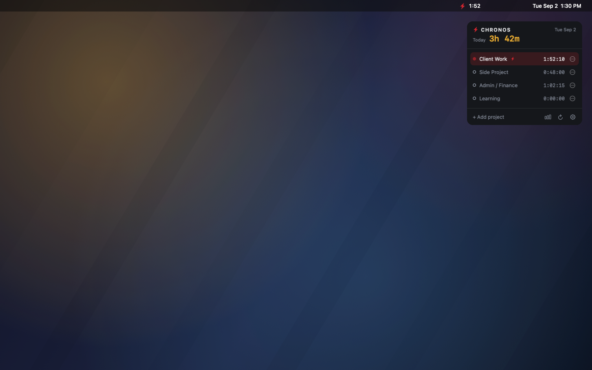

# Chronos

**A time tracker that lives on your desktop.** Chronos is a small panel that
sits on the macOS desktop *behind* your app windows, like a widget you can
actually click. It holds a fixed list of projects: one click starts the clock,
one click stops it, and only one runs at a time. At 04:00 every morning it
closes the running timer, writes the day's totals to CSV and a markdown note,
and resets to zero for the new day. No accounts, no cloud, no network.

<br clear="left">



*The panel on a desktop, rendered from the real views over a generated wallpaper.*

## Why it exists

Nothing quite does this loop. Desktop widgets on macOS (WidgetKit) are
**read-only** — you can look at them, you cannot click them. Electron and
Tauri "desktop-level" windows on macOS stop receiving mouse events once they
are pushed behind app windows, so the whole category is off the table. Menu
bar trackers work, but they hide the thing you want in your eyeline, and
almost none of them archive the day automatically and start you at zero
tomorrow.

Chronos is a native `NSPanel` at desktop-icon window level: behind every app
window, on every Space, and still clickable — without ever stealing focus from
whatever you are typing in. That one window trick is the whole reason this is
a Swift app and not a web app.

## Features

- One-click start/stop on a fixed project list. Starting one stops the other.
- Sits on the desktop behind your windows, on all Spaces, and never activates
  or steals focus when clicked.
- Live per-project times (`H:MM:SS`) and a running day total.
- Automatic daily rollover at a configurable time (default 04:00) that
  archives the day and zeroes the panel — including catching up days missed
  while the Mac was asleep or the app was quit.
- Plain-file archive: `daily-summary.csv`, `sessions.csv`, and a markdown note
  per day.
- CSV export for this week, this month, or any date range.
- A review window with today/week/month totals, per-project bars, a daily bar
  chart, and a few plain-English insights.
- Menu bar bolt with the running project, elapsed time, quick-start, and Quit.
- Crash- and sleep-safe: totals are always recomputed from timestamps, and the
  open session hits disk the instant it starts.
- Launch at login, project colors, reordering, rename, archive.
- Edit or delete today's sessions — fix a timer that ran long, reassign it to
  a different project, or stop a running one at an earlier time.
- No network code of any kind, and no third-party dependencies.

## Install

1. Download `Chronos-vX.Y.Z.dmg` from the [Releases page](../../releases).
2. Open it and drag **Chronos** to your Applications folder.
3. Launch it from Applications.

### Gatekeeper (first launch)

Release builds are **ad-hoc signed and not notarized** — there is no Apple
Developer ID behind this project — so macOS will refuse the first launch with
"Chronos cannot be opened because it is from an unidentified developer."

Either:

- **Right-click** (or Control-click) Chronos in Applications and choose
  **Open**, then **Open** again in the dialog. You only do this once.
- Or strip the quarantine flag yourself:

  ```bash
  xattr -d com.apple.quarantine /Applications/Chronos.app
  ```

If you would rather not run an unnotarized binary, [build from
source](#build-from-source) — a local Xcode build signs itself to run on your
machine.

### Two prompts you will see once

- **Documents folder access.** The first time a day is archived, macOS asks
  whether Chronos may write to Documents (the archive defaults to
  `~/Documents/Chronos`). Allow it, or pick a different folder in Settings. If
  the write fails anyway, Chronos falls back to
  `~/Library/Application Support/Chronos/Archive/` and tells you in the menu
  bar rather than losing the day.
- **Login item approval.** Launch at login is on by default. macOS may show
  Chronos under System Settings › General › Login Items as needing approval;
  the Settings window says so when that is the case.

Chronos runs as a background agent: no Dock icon, no app switcher entry. Quit
from the menu bar bolt.

## Build from source

Requires **Xcode 16 or newer** on **macOS 14 or newer**. No dependencies to
fetch, nothing to configure.

Clone this repository, then:

```bash
xcodebuild -project Chronos.xcodeproj -scheme Chronos -destination 'platform=macOS' build
```

Or just `open Chronos.xcodeproj` and press Cmd-R.

Run the tests with:

```bash
xcodebuild -project Chronos.xcodeproj -scheme Chronos -destination 'platform=macOS' test
```

`Chronos.xcodeproj` is committed so a clone builds with no extra setup, but it
is generated from `project.yml` by [xcodegen](https://github.com/yonaskolb/XcodeGen).
You only need xcodegen if you change `project.yml` or add source files:

```bash
xcodegen generate
```

**Platform support is honest:** macOS 14 is the declared floor and every API
used is available there, but development and testing happen on a much newer
macOS. If something misbehaves on 14 or 15, please
[open an issue](../../issues).

## Where your data lives

Everything is a plain file on your Mac. Nothing leaves it.

### App data (source of truth)

`~/Library/Application Support/Chronos/`

| File | What it is |
|---|---|
| `projects.json` | The project list. |
| `sessions.jsonl` | Every session, append-only, one JSON object per line. |
| `sessions-YYYY.jsonl` | Last year's log, moved aside at the first rollover of a new year. |
| `state.json` | Window position, the last rollover instant, and your settings. |

`projects.json` is an array:

```json
[
  {
    "colorHex": "#D7262F",
    "id": "9F1B5B0E-2E2B-4C55-9E2E-6D4F6E1A2B3C",
    "isArchived": false,
    "name": "Client Work",
    "sortOrder": 0
  }
]
```

`sessions.jsonl` has four record shapes. An `open` line is written the instant
a timer starts (so a crash can never lose a running session), and a `close`
line when it stops:

```json
{"id":"3C2A...","projectID":"9F1B...","start":"2026-09-02T13:19:50.000Z","type":"open"}
{"end":"2026-09-02T15:12:00.000Z","id":"3C2A...","type":"close"}
```

Editing a session in the session editor doesn't rewrite either of those lines
— it appends an `adjust` line instead, and deleting one appends a `delete`
line. `projectID` is only present on an `adjust` when the session moved to a
different project, and `end` is only present when it has one (a still-running
session's `adjust` carries just its new `start`):

```json
{"id":"3C2A...","start":"2026-09-02T13:30:00.000Z","type":"adjust"}
{"end":"2026-09-02T14:45:00.000Z","id":"3C2A...","projectID":"7B4E...","start":"2026-09-02T13:30:00.000Z","type":"adjust"}
{"id":"3C2A...","type":"delete"}
```

Nothing is ever rewritten in place — for any given session id, the **last
line wins**: replaying the file from the top, each `adjust` corrects that
session's start/end/project, and a `delete` removes it outright and ignores
anything recorded for that id afterward. An older build of Chronos that
predates `adjust`/`delete` simply skips lines it doesn't recognize and shows
the session as it was before the edit.

Timestamps in the JSON files are ISO-8601 in UTC. A session with an `open` and
no `close` (and no `delete`) is the one currently running.

### Archive (for reading later)

`~/Documents/Chronos/` by default; changeable in Settings.

**`daily-summary.csv`** — one row per project per day, appended at every
rollover. Columns: `date,project,seconds,hours`.

```csv
date,project,seconds,hours
2026-09-02,Client Work,6730,1.87
2026-09-02,Side Project,2880,0.80
```

**`sessions.csv`** — one row per session. Columns:
`date,project,start,end,seconds`. Timestamps are ISO-8601 with your local UTC
offset, so a row still tells you what time of day it was months later.

```csv
date,project,start,end,seconds
2026-09-02,Side Project,2026-09-02T09:00:00-04:00,2026-09-02T09:48:00-04:00,2880
```

**`daily/YYYY-MM-DD.md`** — a markdown note per day (Settings, on by default).

```markdown
# Chronos — 2026-09-02
**Total:** 3h 42m

| Project | Time |
|---|---|
| Client Work | 1h 52m |
| Side Project | 0h 48m |
```

### The tracking day

A "tracking day" runs **rollover to rollover**, not midnight to midnight. With
the default 04:00 rollover, work you do at 01:00 on Wednesday belongs to
Tuesday, which is where late-night work belongs. Every `date` in the archive
is the tracking day, and a day with no time on it writes nothing at all but
still turns over.

Two things worth knowing:

- Projects with zero seconds are left out of the CSVs.
- The CSVs are **append-only**. A manual reset (the ⟳ button) runs the same
  routine as an automatic rollover, so resetting twice in one day appends a
  second set of rows for that same date. The markdown note, being one whole
  file, is rewritten instead.

Both CSVs drop straight into Numbers, Sheets, pandas, or whatever you point at
them.

### Editing today's sessions

Open the session editor from a project row's `•••` menu ("Edit today's
sessions…") or the menu bar bolt ("Edit Sessions…"). It's for fixing a timer
you forgot about — one that ran for four hours instead of thirty minutes, or
got started on the wrong project.

It only lists **today's** sessions — anything with a start at or after the
last rollover. Earlier days are already written into the append-only archive
CSVs, so editing one would mean rewriting a day that's already been filed;
that's a bigger storage change than a v1 editor, and it's on the roadmap.

Each row lets you:

- Reassign the session to a different project.
- Move its start or end time (a `DatePicker` for each, snapped onto whichever
  side of the rollover boundary the time you pick actually belongs to — so
  picking "23:00" for a session that started at 01:30 means the previous
  evening, not tomorrow).
- **Stop at…**, for the session that's still running: seeds the end with the
  current time and lets you dial it back to when you actually stopped.
- **Delete**, with a confirmation, which removes the session and its time from
  today's total for good.

Nothing is written until you hit **Save**; **Revert** discards the draft.

Overlapping sessions are allowed. If your edit makes two sessions overlap, the
row shows an informational caption naming what it overlaps — it never blocks
Save — and that hour is simply counted in both projects' totals, same as if
you'd started two timers on purpose.

## Settings

Open Settings from the panel's ⚙ button or the menu bar bolt.

| Setting | Default | What it does |
|---|---|---|
| Rollover time | 04:00 | When one tracking day becomes the next. |
| Restart running project after rollover | Off | Reopens the same project in the new day instead of leaving everything stopped. |
| Archive folder | `~/Documents/Chronos` | Where the CSVs and notes are written. Stored relative to your home folder, so a restored backup still finds it. |
| Write markdown daily notes | On | Whether `daily/YYYY-MM-DD.md` is written. |
| Show elapsed time in menu bar | On | The `1:52` next to the bolt. |
| Launch at login | On | Registers Chronos as a login item (`SMAppService`). |
| Projects | — | Rename, recolor, reorder, archive and unarchive. Today's sessions are edited from a project row's `•••` menu instead — see [Editing today's sessions](#editing-todays-sessions). |
| Export | — | This week, this month, or a custom range, saved as CSV with the same columns as `daily-summary.csv`. |

## Review

Open the review window from the panel's chart button or the menu bar bolt
(`Review…`). It is a read-only dashboard over the whole session history on
disk, rotated logs included:

- **Three totals** — today, this week, this month — each with how it compares
  with the period before it (`+2h 10m vs last week`). "This week" and "this
  month" are the calendar week and month containing today's tracking day, and
  the comparison is against the last *complete* one, so early in a week the
  difference is normally negative.
- **By project** — the selected period split into bars, biggest first.
  Archived projects show up when they have time on them.
- **A daily chart** — the last 7 tracking days (Day and Week) or the last 30
  (Month), with today in red. Empty days are drawn as empty days.
- **Insights** — busiest day, average across the days you actually tracked,
  your current streak, and the single longest session in the period. A line is
  left out rather than padded when there is nothing to say.

The Day / Week / Month control drives the bars, the chart, and the insights;
the three totals stay put. Numbers refresh when you open the window, when a
timer starts or stops, and once a minute while the window is open.

## Roadmap

Deliberately short. Chronos is meant to stay a simple daily tracker.

- Idle detection with a "keep / discard" prompt.
- Editing or deleting sessions from earlier days.
- Adding a session that was never tracked.
- A global keyboard shortcut to toggle the last-used project.
- Notes attached to a session.

## Contributing

Bug reports, fixes, and small features that fit the scope above are welcome.
Start with [CONTRIBUTING.md](CONTRIBUTING.md) for how to build, the code style,
what a pull request should include, and where the scope line is drawn. Open an
issue before building anything large, so we can agree on the shape of it first.

## Privacy

Chronos has **no analytics, no telemetry, and no network calls of any kind**.
There is no networking code in the source, no third-party dependencies that
could add some, and nothing is ever uploaded, phoned home, or checked for
updates. Your projects and your hours are files on your disk that you can
read, move, or delete. That is the whole promise, and it is enforced by
review: a pull request that adds a network call will be declined.

## Credits and license

Chronos is [MIT licensed](LICENSE) — © 2026 Chronos contributors.

The lightning bolt mark is original, drawn as a geometric SwiftUI shape and
rendered into the app icon and menu bar images by `Scripts/render-icons.swift`.
No third-party artwork, fonts, or code are bundled: the app is Foundation,
SwiftUI, and AppKit only.

Design and behavior are specified in [docs/SPEC.md](docs/SPEC.md); the
implementation notes and hard-won gotchas live in [CLAUDE.md](CLAUDE.md).
